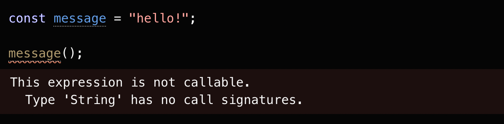

# The Basics ( 基础 )

欢迎来到手册的第一页。如果这是你第一次接触 TypeScript - 你可能想从“入门” 指南中的一个开始

JavaScript 中的每个值都有一组行为，您可以从运行不同的操作中观察到这些行为。这听起来很抽象，下面我们举一个简单的例子，我们将在一个名为 `message ` 的变量上进行一系列的操作

``` Javascript
// 访问并调用 message 变量上的 toLowerCase 属性
message.toLowerCase();

// 调用 message 函数
message();
```

如果我们将其分解，会发现，第一行可运行的代码将访问一个名为 `toLowerCase ` 的属性，然后调用它。第二个尝试直接调用 `message` 方法。

但是大多数情况下，我们很可能不知道 `message` 的值，如此一来我们就不能完全预测代码的执行结果。  

上述代码的行为完全取决于一开始给定的 `message` 的值。

+ `message` 的一个可被调用的方法么 ?
+ `toLowerCase` 属性是否真实存在于 `message` 上 ?
+ 若是 `toLowerCase` 存在，那么它是一个可被调用的方法么 ?
+ 若是 `message` 和 `toLowerCase` 都存在，且可被调用，那么他们各自的执行结果分别是什么 ？

当我们编写 JavaScript 代码时，我们要时刻询问自己上述问题，来保证我们写的代码的所有细节都经得起推敲。

现在我们假设 `message` 变量的定义如下: 

``` Javascript
const message = "Hello World!";
```

正如我们所想的那样，上述代码会返回全小写的字符串 `hello world`。

那第二行代码呢? 如果你熟悉 JavaScript，那您肯定了解下面这个异常信息 :

``` Javascript
TypeError: message is not a function
``` 

如果我们能避免这样的错误就太好了。当我们运行代码时，参与运算的值的类型所具有的行为和能力决定了我们编写的 JavaScript 在运行时的行为表现。而TypeScript 针对的恰恰就是这一点，TypeScript 会提示我们 `String` 类型的变量 `message`  不能被当做一个方法被调用。

对于某些值，例如基础的 string 和 number 类型，我们在运行时可以使用 `typeof` 来获取它们的类型。但是对于例如 `function` 等其他非基础类型的变量，没有对应的运行时机制去获取它们的类型。我们举个例子，看下面这个函数：

``` Javascript
function fn(x) {
  return x.flip();
}
```

通过以上代码，我们可以得知，该函数只有在接受一个具有可调用属性 `flip` 的对象作为形参时才能正常工作，但是在运行结果出来以前，JavaScript 不会显式提醒我们这些信息。这就使得我们在编写代码时很难预测代码执行时的行为。

从这个角度来看，类型系统的存在是为了描述哪些值可以传递给函数 `fn`, 哪些值可能导致程序崩溃。目前的 JavaScript 只能提供运行时的动态类型，而不具备静态类型检查的能力。

故而我们可以选择使用一个静态类型系统来预测运行前的代码。

## 静态类型检查 (Static type-checking)

回想之前我们尝试将字符串作为函数来调用时得到的 TypeError。大多数人在运行他们的代码时都不希望出现错误 ( bug ! ) 。当我们编写新代码时，我们总是竭尽所能尽可能少得引入新的 bug。

如果我们添加一些代码，保存并重新执行我们的代码，立刻就能看到抛出的错误，我们则可以快速隔离并修复问题。但在实际的开发工作中，现实往往不总是那么尽如人意。有可能我们没有对我们开发的新功能进行足够彻底的测试，从而导致我们无法发现潜在的错误。即使我们很幸运得在开发时就发现了错误，但是假设我们现在正在进行重构工作，此时我们不得不终止大型的重构工作，并添加大量代码去修复该问题，并且付出大量的心力和成本以保证修复代码没有任何潜在的问题。

理想情况是，我们可以有一个工具来帮助我们在代码运行之前就找到这些 bug。这就是 TypeScript 这样的静态类型检查器所做的。静态类型系统描述了当我们运行程序时，我们的值的形状和行为。像 TypeScript这样的类型检查器就会使用这些信息来告诉我们什么时候可能会出问题。




